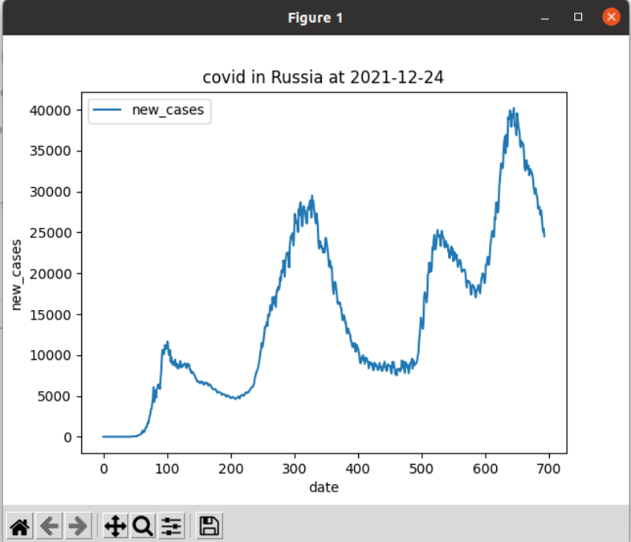

## Приложение для статистики по коронавирусу.
## Данные с https://ourworldindata.org/coronavirus  https://github.com/owid/covid-19-data/tree/master/public/data

## Требования:
1. python 3.6 или выше;
2. pip.

## Запуск:

1. Создайте виртуальную среду: `python3 -m venv venv`
2. Перейдите в нее: `source venv/bin/activate`
3. Установите зависимости: `pip install -r requiremments.txt`
4. Запустите приложение: `python3 covid.py <location> <args>`
Здесь:
1. `location` - Название страны на английском, например `Russia` или `Ukraine`
2. `args` - Название столбцов базы данных дял добавления на график. Внимание! matplotlib рисует график в масштабе, поэтому не стоит добавлять слишком большие значения и относительно малые - изменения малых будут скрыты масштабом. 
<<<<<<< HEAD
3. Пример: Новые случаи России: `python3 covid.py Russia new_cases`;
<br>
=======
3. Пример: Новые случаи России: `python3 covid.py Russia new_cases`;  



>>>>>>> d92766352555998ebf1ab3aeb0cb9e70e2fc0563
## Реализация:
1. Приложение скачает в рабочий каталог csv файл с https://ourworldindata.org/coronavirus;
2. На основе csv файла в памяти создется sqlite база данных;
3. Приложение собирает аргументы из командной строки и передает их для запроса к базе данных, затем matplotlib строит соответствующий график.
		
## Все возможные значения arg:
<<<<<<< HEAD
'''
      "iso_code" TEXT,
      "continent" TEXT,
      "location" TEXT,
      "date" TEXT,
      "total_cases" REAL,
      "new_cases" REAL,
      "new_cases_smoothed" REAL,
      "total_deaths" REAL,
      "new_deaths" REAL,
      "new_deaths_smoothed" REAL,
      "total_cases_per_million" REAL,
      "new_cases_per_million" REAL,
      "new_cases_smoothed_per_million" REAL,
      "total_deaths_per_million" REAL,
      "new_deaths_per_million" REAL,
      "new_deaths_smoothed_per_million" REAL,
      "reproduction_rate" REAL,
      "icu_patients" REAL,
      "icu_patients_per_million" REAL,
      "hosp_patients" REAL,
      "hosp_patients_per_million" REAL,
      "weekly_icu_admissions" REAL,
      "weekly_icu_admissions_per_million" REAL,
      "weekly_hosp_admissions" REAL,
      "weekly_hosp_admissions_per_million" REAL,
      "new_tests" REAL,
      "total_tests" REAL,
      "total_tests_per_thousand" REAL,
      "new_tests_per_thousand" REAL,
      "new_tests_smoothed" REAL,
      "new_tests_smoothed_per_thousand" REAL,
      "positive_rate" REAL,
      "tests_per_case" REAL,
      "tests_units" TEXT,
      "total_vaccinations" REAL,
      "people_vaccinated" REAL,
      "people_fully_vaccinated" REAL,
      "total_boosters" REAL,
      "new_vaccinations" REAL,
      "new_vaccinations_smoothed" REAL,
      "total_vaccinations_per_hundred" REAL,
      "people_vaccinated_per_hundred" REAL,
      "people_fully_vaccinated_per_hundred" REAL,
      "total_boosters_per_hundred" REAL,
      "new_vaccinations_smoothed_per_million" REAL,
      "new_people_vaccinated_smoothed" REAL,
      "new_people_vaccinated_smoothed_per_hundred" REAL,
      "stringency_index" REAL,
      "population" REAL,
      "population_density" REAL,
      "median_age" REAL,
      "aged_65_older" REAL,
      "aged_70_older" REAL,
      "gdp_per_capita" REAL,
      "extreme_poverty" REAL,
      "cardiovasc_death_rate" REAL,
      "diabetes_prevalence" REAL,
      "female_smokers" REAL,
      "male_smokers" REAL,
      "handwashing_facilities" REAL,
      "hospital_beds_per_thousand" REAL,
      "life_expectancy" REAL,
      "human_development_index" REAL,
      "excess_mortality_cumulative_absolute" REAL,
      "excess_mortality_cumulative" REAL,
      "excess_mortality" REAL,
      "excess_mortality_cumulative_per_million" REAL
'''
=======
```
"iso_code" TEXT,
"continent" TEXT,
"location" TEXT,
"date" TEXT,
"total_cases" REAL,
"new_cases" REAL,
"new_cases_smoothed" REAL,
"total_deaths" REAL,
"new_deaths" REAL,
"new_deaths_smoothed" REAL,
"total_cases_per_million" REAL,
"new_cases_per_million" REAL,
"new_cases_smoothed_per_million" REAL,
"total_deaths_per_million" REAL,
"new_deaths_per_million" REAL,
"new_deaths_smoothed_per_million" REAL,
"reproduction_rate" REAL,
"icu_patients" REAL,
"icu_patients_per_million" REAL,
"hosp_patients" REAL,
"hosp_patients_per_million" REAL,
"weekly_icu_admissions" REAL,
"weekly_icu_admissions_per_million" REAL,
"weekly_hosp_admissions" REAL,
"weekly_hosp_admissions_per_million" REAL,
"new_tests" REAL,
"total_tests" REAL,
"total_tests_per_thousand" REAL,
"new_tests_per_thousand" REAL,
"new_tests_smoothed" REAL,
"new_tests_smoothed_per_thousand" REAL,
"positive_rate" REAL,
"tests_per_case" REAL,
"tests_units" TEXT,
"total_vaccinations" REAL,
"people_vaccinated" REAL,
"people_fully_vaccinated" REAL,
"total_boosters" REAL,
"new_vaccinations" REAL,
"new_vaccinations_smoothed" REAL,
"total_vaccinations_per_hundred" REAL,
"people_vaccinated_per_hundred" REAL,
"people_fully_vaccinated_per_hundred" REAL,
"total_boosters_per_hundred" REAL,
"new_vaccinations_smoothed_per_million" REAL,
"new_people_vaccinated_smoothed" REAL,
"new_people_vaccinated_smoothed_per_hundred" REAL,
"stringency_index" REAL,
"population" REAL,
"population_density" REAL,
"median_age" REAL,
"aged_65_older" REAL,
"aged_70_older" REAL,
"gdp_per_capita" REAL,
"extreme_poverty" REAL,
"cardiovasc_death_rate" REAL,
"diabetes_prevalence" REAL,
"female_smokers" REAL,
"male_smokers" REAL,
"handwashing_facilities" REAL,
"hospital_beds_per_thousand" REAL,
"life_expectancy" REAL,
"human_development_index" REAL,
"excess_mortality_cumulative_absolute" REAL,
"excess_mortality_cumulative" REAL,
"excess_mortality" REAL,
"excess_mortality_cumulative_per_million" REAL
```
>>>>>>> d92766352555998ebf1ab3aeb0cb9e70e2fc0563
