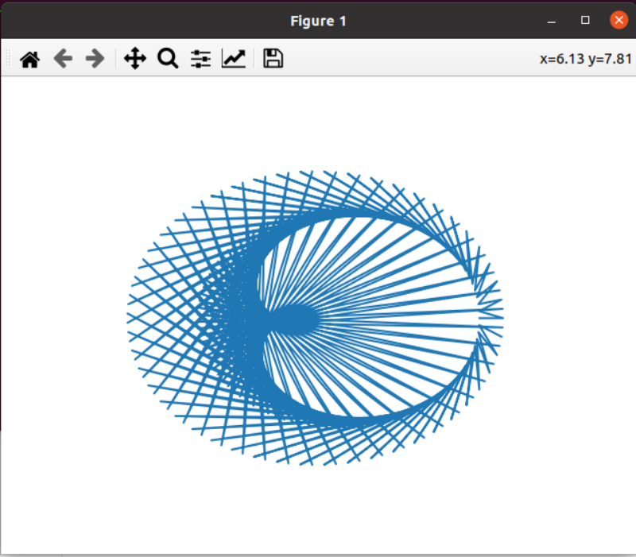

# elliptical orbits 

<<<<<<< HEAD
<<<<<<< HEAD
# Две точки движутся по эллипсу с различными скоростями, каждую единицу времени они соединяются линиями. 

=======
## Две точки движутся по эллипсу с различными скоростями, каждую единицу времени они соединяются линиями. 

>>>>>>> d927663... Update README.md
=======
## Две точки движутся по эллипсу с различными скоростями, каждую единицу времени они соединяются линиями. 

>>>>>>> d92766352555998ebf1ab3aeb0cb9e70e2fc0563

## Запуск:

1. Создайте виртуальную среду: `python3 -m venv venv`
2. Перейдите в нее: `source venv/bin/activate`
3. Установите зависимости: `pip install -r requiremments.txt`
4. Запустите приложение: `python3 plot.py`

